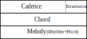

# これは
作曲補助プログラムです。
[ここ](http://uncotechhack.net/preview/auto_compose/)からでも使えます。
各種パラメータに基づき楽節を自動生成します。
西洋の音楽理論をベースにしていますが、簡略化や誤りを含みます。
作曲したいがゼロから作るのは厳しい、という時にどうぞ。

# 著作権について
このプログラム自体の著作権はauthor(hyranno)に帰属し、MIT Licenseで利用できます。
このプログラムは機械学習を採用していないので、学習データセットの著作権問題は存在しません。

プログラムが出力したままの楽曲については、著作権が認められない可能性があります。
AIによって生み出される創作物の取扱いに準ずるものと考えられますが、法に詳しい人に確認してください。

プログラムの出力を元に編曲・作曲されたものについては、編曲・作曲した人に著作権があります。

# つかいかた
画面上部は各種パラメータ設定、 画面中央はピアノロール、 画面下部は出力パネルになっています。

## パラメータ設定
生成に用いられるパラメータを設定できます。
各パラメータの意味については後述します。
パラメータを変更後、generateボタンを押して曲を再生成してください。

入力フォームが用意されているのは一部のパラメータのみです。
全てのパラメータを設定するにはJSONファイルを読み込んでください。
ファイルの例はresourcesフォルダにあり、書式はschemasフォルダにあります。
変更した設定はsave as fileボタンでファイルに保存できます。

## ピアノロール
縦軸に音高、横軸に時間を取るピアノロールです。
左端の数字はMidiノートナンバーを表します。
上端に表示されている色はCadenceを表し、青がTonic、黄色がSubdominant、赤がDominantを表しています。

ピンク色はキーの高さを表しています。
スケールに含まれる音は白、含まれない音は灰色で表されます。
オレンジ色はコード(和音)に含まれる音を表し、濃い部分はルート(根音)を表しています。
青色はメロディの音を表しています。

## 出力パネル
生成された曲をplayボタンで聞いたり、midiファイルに出力することができます。
midiファイルをDAWやDTMソフトで読み込んで編集することを想定しています。

## パラメータ概説
入力フォームから設定できるパラメータの概要を説明します。
このセクションではとりあえず使えることを目標とします。
パラメータの詳細を理解するにはアルゴリズムのセクションを参照してください。

* 共通
    + seed ... 乱数のシード値です。これを変えると似た感じの別の曲になります。
        値自体に意味は無いので自由な数字を入れてかまいませんが、0付近は避けた方が無難です。
* Scale
    + key ... キー音です。
    + tones ... スケールを、キー音からの相対音高で表します。 Major/minorのボタンで入力できます。
* Resolution ... 4小節がどのように終わるかを設定します。
    曲が続く感じにしたいならHalfやPlagal、終わった感じにしたいならPerfectなどを選ぶとよいでしょう。
* Time Measure ... 拍子です。
* Cadence
    + duration ... コードが切り替わる周期を設定します。4/4拍子なら2か4、3/4拍子なら3が適当です。
* Note
    + rhythm
        - max beat division depth ... 最も短い音の長さを設定します。2^x分音符になります。
        - pBranchEdges ... 音をどれだけ分割するかを設定します。
            左の値が小さいと短い音が多く、右の値が大きいと長い音が少なくなります。
        - pNoteOnEdges ... 音がどれくらい休符になるかを設定します。値が小さいと休符になりやすくなります。
    + pitch weight
        - absPitchFactorEdges ... 大きいと、キー音から離れた音が出やすくなります。
        - relPitchFactorEdges ... 大きいと、直前の音から離れた音が出やすくなります。
        - factorInScale ... 大きいと、スケール内の音が出やすくなります。
        - factorInChord ... 大きいと、コード内の音が出やすくなります。
        - rhythmExponentFactor ... 大きいと、音の長さが音高選択に与える影響が大きくなります。

# アルゴリズム
このセクションでは、プログラムがどのように楽節を生成しているかを説明します。
アルゴリズムやパラメータの詳細な理解を得るには、ソースコードと併せて読んでください。
音楽理論をどのように実装しているかという話にもなりますが、
用語等は誤りを含む可能性があるので注意してください。
マルコフ連鎖など確率過程の知識を要求する箇所があります。

生成される楽節は前半と後半からなり、前半を生成したのち、
それを基に変更を加えて後半(variant)を生成しています。

生成は抽象度の異なる複数の段階からなり、cadence(終止形)、chord(和音)、メロディのrhythm、pitchの順で生成されます。

## 前半生成
楽節の前半を生成する部分です。
ソースコードではTuneGenerator.tsxがトップレベルです。TuneGenerator.Parameters をJSONから読み込みます。

### Cadence
chordが具体的な音の集合であるのに対し、
chordが持つ機能や性質を表すものを和声機能、
和声機能の連なりをcadence(終止形)と呼びます。
和声機能はTonic/Dominant/Subdominantの3値を取り、
それぞれ次に取りうる値がある程度決まっています。
このプログラムではcadenceを、上記3値を状態とした、斉時的有限状態マルコフ連鎖と考えて生成しています。
ただしcadenceの末尾パターンはresolution(終止)で決定されます。

斉時的有限状態マルコフ連鎖では、条件を満たせば定常状態を計算可能です。
定常状態を用いて、後ろ向きの遷移確率や、
時間上の2点で与えられた分布に対してその間の条件付き確率分布を求めることができます。
このプログラムでは、現在の状態と末尾パターンから、条件付き確率分布を用いて次の状態(Cadence)を決定します。

### Chord
chordはroot(根音)とtones(構成音)からなり、cadenceに依存します。
本来なら一部chordはResolutionの影響を受けますが、実装が煩雑になりそうなので無視しています。
構成音の一部についてオクターブを変更する転回についても取り扱っていません。

rootはスケール上でキー音から何度の音高かで表します。
rootはcadenceの和声機能ごとに値がある程度決まるので、和声機能ごとに設定された無記憶情報源から抽選しています。
tonesはスケール上で根音から何度の音高かで表し、例えば(0,2,4)は三和音です。
tonesの理論はよく分からないので無記憶情報源から抽選しています。

### Rhythm
rhythmについては音楽理論が手近で見当たらなかったので独自方式を採用しています。
拍の長さを1として、各拍を再帰的かつ確率的に2分割し、
そこで得られた音の長さそれぞれを確率で休符にします。
分割する確率と休符にしない確率は現在の音の長さに依存し、
それぞれpBranchEdgesとpNoteOnEdgesをエッジとしたsmoothstepに従います。
ただし、max beat division depth 以上には分割しません。

### Pitch
rhythmで得られた音の長さそれぞれに対してpitchを設定し、メロディを生成します。
pitchはscale, chord, rhythmに依存するマルコフ連鎖として扱います。
時間信号であるchordとrhythmの影響を受けるので斉時的とは言えないことに注意してください。
本来なら一部pitchはResolutionの影響を受けますが、実装が煩雑になりそうなので無視しています。

pitchは候補の中から、対応付けられた重みに従い抽選され、それぞれの候補の重みは以下で計算されます。

weight = (absPitchFactor * relPitchFactor * scaleFactor * chordFactor) ^ (1 + rhythmExponent)

* absPitchFactor ... キー音からの距離に依存し、absPitchFactorEdgesをエッジとしたsmoothstepで計算されます。
* relPitchFactor ... 直前の音高からの距離に依存し、absPitchFactorEdgesをエッジとしたsmoothstepで計算されます。
* scaleFactor ... スケールに含まれる音ならfactorInScale、そうでないなら1です。
* chordFactor ... コードに含まれる音ならfactorInChord、そうでないなら1です。
* rhythmExponent ... 短い音では奇抜な音を出しやすく、長い音では無難な音にするための項です。
    rhythmExponent = rhythmExponentFactor * 音の長さ

## Variant生成
与えられた曲を基にアレンジを加えた曲を生成する部分です。
アレンジを加える時間範囲と、アレンジを加える段階(cadence, chord, pitch, rhythm)を設定しておきます。
ソースコードではVariantGenerator.tsxがトップレベルです。VariantGenerator.Parameters をJSONから読み込みます。

### Cadence で変更を加える
アレンジを加える範囲について、その前後の状態を考慮した条件付き確率分布に従うマルコフ連鎖で再生成します。
Cadenceに依存するChord, Pitchも再生成されます。

### Chord で変更を加える
アレンジを加える範囲について、新たな乱数でchordを再生成します。
Chordに依存するPitchも再生成されます。

### Pitch で変更を加える
アレンジを加える範囲について、
その前後の音高を考慮した条件付き確率分布に従うマルコフ連鎖で再生成します。
ただし前述のようにrhythmとchordへの依存により斉時的ではないので、
そのまま条件付き確率分布を求めるのは厳しいです。
よって、rhythmとchordの影響を排した斉時的有限状態マルコフ連鎖によって条件付き確率分布を求めたのち、
直後の分布にのみrhythmとchordの影響を後付けして計算しています。

### Rhythm で変更を加える
アレンジを加える範囲について、
音の長さを確率的に分割・結合、休符か否かを再抽選し、変更があった箇所のpitchを再生成します。
